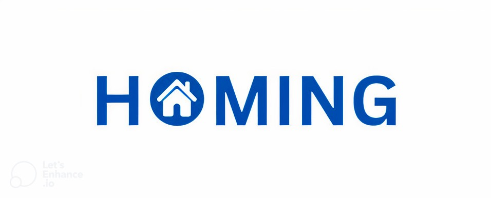

  
  

    <strong>Decentralized Real World Asset Investment Platform</strong>
  

## Inspiration

Our project is a decentralized platform that enables fractional ownership of real estate through tokenization. By utilizing BNB Chain smart contracts and ERC1155 tokens, we allow users to invest in real estate projects, track their investments, and earn returns. The platform ensures transparency, security, and ease of investment in real-world assets. Key features include project creation, share purchasing, and automated profit distribution. Our goal is to democratize real estate investment, making it accessible to a broader audience while leveraging blockchain’s immutability and transparency.

## What is Homing

Homing is a platform to invest in real estate projects through fractional ownership.

Investors can participate in funding real world building projects and acquire fractional ownership through the purchase of tokenized shares. These shares, represented as NFTs on the blockchain, entitle investors to a percentage of the project value upon successful completion and sale.

## How it works

Projects are listed on Homing with the corresponding data, like the amount of shares available, the goal amount or investment expected profit.

When investors decide to buy the tokenized shares of a project, they get an amount of ERC1155 tokens equal to the number of shares they bought. These shares represent the ownership of a fraction of the building and can be kept or traded in the open market.

When the project is completed and the building has been sold, project shares can be redeemed by burning the corresponding NFT and obtaining an amount based on how much profitable was the selling of the construction.

In the same way, builders can list projects, get funded to build/manage them and obtain a builder fee for the work done.

## Main features

### Tokenization of real world assets

Facilitate the tokenization of real world properties, transforming them into digital tokens on a blockchain. This process enables fractional ownership, providing investors with the opportunity to acquire shares in tangible assets traditionally considered out of reach.

### Decentralized funding and transparency

Provide decentralized funding for real world building projects. Through the use of smart contracts, the platform enhances transparency, reducing the risk of fraud and conflicts. Investors benefit from increased visibility into project details, expenditure, and progress, fostering a transparent and trustworthy investment environment.

### Fractional real estate ownership

Enable investors to participate in real estate projects by acquiring fractional ownership through tokenized shares. This feature allows individuals to diversify their real estate portfolios, even with smaller investment amounts, and benefit from potential returns when the properties are sold.

### Crowdfunding for construction projects

The platform serves as a crowdfunding mechanism for construction projects, allowing builders to access funding from a wide pool of investors. This empowers builders to initiate and complete projects that might face challenges in securing traditional financing, fostering innovation and community involvement.

### Global investment in local real estate

Investors, regardless of their geographic location, can engage in real estate investments worldwide. Homing breaks down geographical barriers, providing global investors with the opportunity to support and benefit from local construction projects, fostering a more interconnected and accessible real estate market.

## Demo Video:
YouTube video link: -  https://drive.google.com/drive/folders/1l3j4_8vKBcuEo4b43POGLzmuVLxxXOi0?usp=sharing

## Technical Aspects

## Architecture

The architecture of the platform is based on:

- Two smart contracts:
  - HomingManager: the main contract that handles the different phases of projects lifecycle
  - HomingShare: a NFT contract that comply with ERC1155 tokens standard and represents projects shares
- A web application made with nextjs and wagmi libraries to interact with the smart contracts deployed on BNB testnet.

## Useful links

- Contracts (Deployed on BNB testnet):
  - HouseformManager: https://hashscan.io/testnet/contract/0.0.4725481
  - HouseformShare: https://hashscan.io/testnet/contract/0.0.4725482
